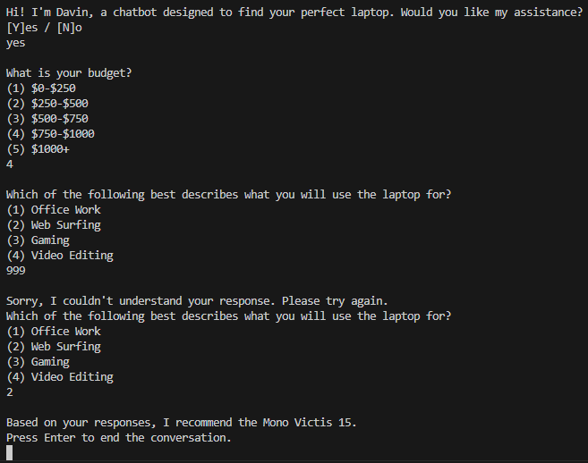

# egain-assignment
I have implemented a chatbot that recommends the user a laptop based on their responses.

## Setup
1. Make sure Python is installed. This code was written in Python 3.13.6, but any 3.x version should work.
2. Clone the repository.
3. Run main.py. You can do this through the Python IDLE or through the command line. 

## Approach
Currently, the chatbot asks for the user's budget and their primary use case for the laptop, infers the ideal laptop specs based on the responses, and picks the laptop that best matches the specs. These questions were chosen because they can be understood by non tech-savvy people, who I imagine would be the most common user of the chatbot.

## Examples

